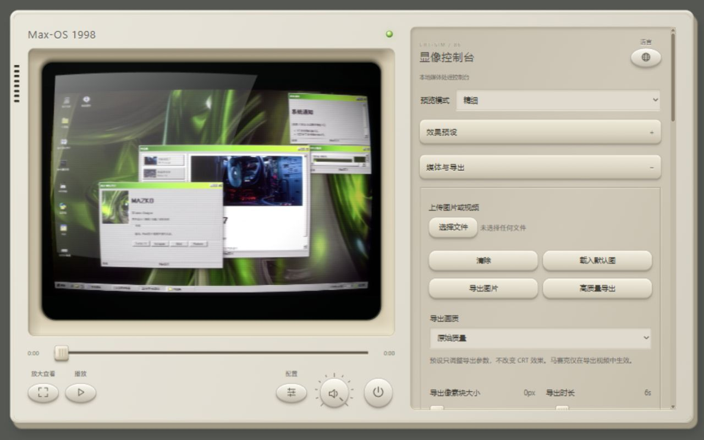

<div align="center">

# CRT Simulator

**Max-OS 1998**

**A retro terminal for your images, videos and sound.**<br />
**把图片、视频与声音，带回显像管时代。**

WebGL · CRT / VHS · PNG / MP4 / WebM · Local processing

[**在线体验 · Live demo**](https://mazkosoft.github.io/CRT-Simulator/) · [**单文件版 · Standalone**](dist/crt-simulator-standalone.html) · [**English**](#english) · [**简体中文**](#简体中文)



*Project credit: ㄢ誌慖（mazko）*

</div>

---

<a id="english"></a>

## English

[Getting started](#getting-started) · [User guide](#online-user-guide) · [Development](#local-development-and-structure) · [License](#credits-and-licensing)

A browser-local image/video effects tool in a beige retro terminal. The current
renderer uses multipass **WebGL**, not the previous DOM/SVG implementation.
It is a creative CRT/VHS approximation, not a calibrated hardware emulator.
Project credit: ㄢ誌慖（mazko）.

### Getting started

| Use it your way | Start here |
| --- | --- |
| In the browser | [Open the live demo](https://mazkosoft.github.io/CRT-Simulator/) — no installation |
| One file, offline | [Download the standalone HTML](https://github.com/mazkosoft/CRT-Simulator/raw/refs/heads/main/dist/crt-simulator-standalone.html), save as `.html`, then open it in a browser |
| Work on the source | Clone the repository and serve the root `index.html`; see [development](#local-development-and-structure) |

The standalone release embeds the default image, styles, application scripts,
Mediabunny and full license notices. It needs no sibling files, CDN or network
connection for processing. External About/Credits links still require a connection.
If GitHub shows the file as text, use **Download raw file** rather than saving the
GitHub page. Download links reflect the deployed repository, not unpublished local changes.

Browser security, WebGL and codec support still apply. If direct file opening limits
export/storage on your browser, use the live site or serve the HTML over localhost.

### Features

- Curvature, RGB phosphor, mask, glow and moving beam.
- VHS noise, jitter, interlace, chroma bleed, sharpening and dropouts.
- Built-in/custom presets, JSON import/export and local configuration.
- Playback, seeking, volume dial, fullscreen zoom/pan and mobile fine adjustment.
- PNG and offline frame-by-frame MP4/WebM export with WebCodecs/Mediabunny.
- Export audio gain, bandwidth, hiss, distortion, modulation and reverb.
- Automatic encoded samples on the CRT screen, with processed audio and the selected compression settings.
- English/Chinese controls, About and Credits groups.

### Online user guide

#### Load media and choose a look

Open the [live demo](https://mazkosoft.github.io/CRT-Simulator/). The supplied image
loads automatically. In **Media import**, choose an image/video. **Load default
image** and **Clear** both return to the sample; neither deletes your local file.
Input format support depends on browser decoders.

Preview mode, performance, automatic updating, refresh and status are directly
visible above every group. The eleven groups are ordered as follows:

1. Media import
2. Effect presets
3. Pixel resolution
4. CRT screen
5. Color settings
6. VHS settings
7. Audio settings
8. Video settings
9. Media export
10. User guide
11. About & credits

Media import is expanded initially; other groups open as needed. **Pixel
resolution** controls live pixelation, the linked RGB cell period and the mask.
**CRT screen** contains curvature, flicker, vignette, beam and glow; **Color
settings** contains brightness, contrast, saturation and media blur. **Video
settings** contains quality, mosaic blocks, duration and encoding parameters;
**Media export** contains save actions and progress. Use encoded preview to
inspect export-only mosaic. Configuration remains below the screen.

Every numeric parameter has an editable number field on desktop and mobile.
Use the adjacent minus/plus buttons to adjust by the parameter step.
Press Enter or leave the field to apply it; values follow the parameter's limits
and step size. Dragging a slider attracts values within 0.12 of a valid integer.
Ranges spanning one unit or less retain fractional control. Typed values,
keyboard adjustments and presets do not trigger integer attraction.

Use `contain` for the full source, `cover` to fill/crop, or `fill` to stretch.
The default **Media Bounds** limits effects to the displayed media footprint; it
does not crop the exported file to the source aspect ratio. Choose **Source aspect
ratio** separately when you want source-shaped output without letterbox bars.
**Source aspect ratio** makes exported dimensions follow the source instead of
adding letterbox bars. Curvature/vignette may still create intentional dark edges.
The preview screen ratio can differ from the export ratio.

In **Presets**, select a built-in look and press **Apply**, then adjust CRT,
phosphor/mask, beam/glow and VHS groups. Save your current settings before replacing
them with a preset. On phones use number fields and `−`/`+` for precision; the panel
scrolls independently. **Fine/Smooth** changes preview refresh rate, not export quality.

#### Playback and inspection

**Play/Pause** controls video. Dragging the timeline pauses and seeks; press Play
to resume. Images have no active timeline. Drag the volume dial up/right to increase
or down/left to decrease; wheel/arrows also work, Home sets zero and End sets maximum.
Zero is mute. This controls original-source listening only, not export audio.

**View** enters fullscreen or an in-page fallback. Use `+`/`−`, wheel or two-finger
pinch to zoom, drag to pan, and the percentage button to reset. Exit or Escape returns.
Zoom affects inspection only. The power key hides the preview; it does not unload
media or stop video playback.

#### Configuration

Encoded preview is selected by default. JSON presets include every effect, audio
and export parameter, plus preview mode/quality, automatic updates, audio audition
and playback volume. Import/export them through **Config** below the screen.
Older parameter-only JSON files remain compatible. Media files are not embedded.

**Config** opens JSON import/export, local save/load and reset. Named presets and
local settings belong to the current browser/origin, not other devices. Export JSON
for backup/sharing; it contains settings, not media. Keep existing configuration keys.

#### Image and video export

Export resolution defaults to **1×**. Loading a video sets export duration to its
exact source duration (including videos longer than 60 seconds); still images default
to six seconds. You can shorten duration with the slider or numeric input.

**Export quality** is independent of CRT/audio presets:

| Preset | Scale | Frame rate | Video bitrate | Pixel blocks |
| --- | ---: | ---: | ---: | --- |
| Original quality | 1× | 30 fps | 50 Mbps | Off |
| Low quality | 0.5× | 24 fps | 1.5 Mbps | Off |
| Network patina | 0.25× | 15 fps | 0.25 Mbps | Off |
| Mosaic | 0.5× | 15 fps | 0.5 Mbps | 12 px |

Block size is adjustable from 0 (off) to 32 pixels and is included in JSON configuration.
Manual changes switch to Custom. Actual dimensions depend on the screen size; bitrate is a target,
so compression artifacts vary by codec and scene. These presets are not simulations
of actual repeated social-media transcoding.

The progress bar counts completed video frame submissions, then shows audio progress
and file finalization separately. Remaining time estimates cover the video stage only.
Finalization is indeterminate; “Export complete” appears only when the file is built,
not when the browser has finished saving it. Compatibility recording uses playback
time and lacks offline mosaic/audio processing.

**Export image** saves the current processed frame as PNG. Casing, glass reflection
and controls are excluded.

Before **High-quality export**, set duration, fps, bitrate, resolution multiplier and
format. MP4 uses H.264/AAC and WebM VP9/Opus when a source audio track is available.
A still image can generate an animated effects clip. Video export starts at source
time zero, not the timeline cursor. Keep duration within the source length for
predictable audio/video output; this is not an in/out editing range.

Try 1–3 seconds, 30 fps and 1× resolution first. Bitrate is an encoder target, not
a file-size/quality guarantee. Seeking, rendering and encoding depend on the device;
offline export is not necessarily faster than realtime. Keep the tab open and active.
Long/high-resolution outputs consume memory. Check the resulting file before use.

#### Retro audio

Select a preset in **Retro audio**, then adjust export gain, bandwidth, hiss,
distortion and wow/reverb. Mono/stereo source channel counts are retained on export;
multichannel sources are downmixed to stereo. Choose **Original / Processed** and press
**Enable audition** while playing a video to hear changes live. This audition shares
the export processing graph but does not simulate codec compression. Silent sources remain silent. Preview-volume zero does not mute export;
adjust export audio gain separately.

Choose **Preview content → Encoded preview** to see an actual encoded sample on
the CRT screen, including processed/compressed audio. After settings stop changing
for 400 ms, the app generates up to two seconds near the playback cursor and loops
the sample. The source video pauses while the sample is displayed to avoid double
audio. Play/pause, timeline, volume and fullscreen zoom control the same screen.
Seeking outside the sample requests a new segment. Choose **Live effects** to
return to the original media with immediate effect adjustments.

Generating a sample does not lock the controls or resize the visible renderer.
New settings cancel superseded jobs; old results cannot replace the newest one.
On slower devices, disable **Update encoded preview automatically** and press
**Refresh encoded preview** when ready. Autoplay may require pressing Play.
Only one job and one result are retained; large intermediate render buffers are
released after each job. Resolution/bitrate are not silently reduced.

This is delayed automatic sample encoding, not zero-latency continuous codec
preview. Short samples may compress differently from a long export due to keyframe
placement and rate control. They do not replace/download the full export.
Audio encoding support is checked before video rendering; supported sample rates
and bitrates are selected without removing the track or changing channel count.
If native AAC is unavailable, the bundled official Mediabunny AAC extension
automatically uses its software encoder. It needs no external download, including
in the standalone file. If initialization fails, try WebM/Opus. Browser video
decoding/encoding support is still required. Video export reads decoded frames in
timestamp order using a bounded canvas pool instead of seeking the player per frame.

Known limitations: Audio is processed in decoded chunks, which can limit reverb tails and
modulation continuity at boundaries. The compatibility recorder does not provide
the same offline audio processing. Decoder/encoder support varies by browser.

### Local development and structure

For source development, clone/download the complete repository, not just `index.html`.
Standalone users need only the single release HTML. The split source needs no build step:

```sh
python -m http.server 8080 --bind 127.0.0.1
```

With Windows' Python launcher use `py -m http.server 8080 --bind 127.0.0.1`.
Open `http://127.0.0.1:8080/`.
Use localhost HTTP or HTTPS for consistent codec behavior; `file://` is not recommended.
Node.js is only needed for developer checks and rebuilding the single-file release.

```text
index.html                 Page structure / GitHub Pages entry
css/crt.css                Casing, screen and physical controls
css/ui.css                 Parameter panel, dialogs and sliders
js/config.js               Defaults, presets and configuration
js/preview.js              Cancellable, latest-settings-only preview scheduling
js/crt.js                  WebGL, media and image/video/audio export
js/controls.js             UI, language, transport and startup
assets/demo-desktop.png    Supplied default image
assets/readme-preview.jpg  Actual application screenshot
vendor/                    Mediabunny bundle and its license
tests/structure.test.cjs   Dependency-free checks
tests/standalone.test.cjs  Self-contained/reproducible release checks
tests/preview.test.cjs     Preview scheduling and renderer isolation checks
scripts/build-standalone.cjs Single-file generator
dist/crt-simulator-standalone.html Complete offline release
CONTRIBUTING.md            Development / bug-report guide
LICENSE                    Original-code MIT license
THIRD_PARTY_NOTICES.md     Third-party provenance and licenses
```

Classic scripts share scope and load in `config → crt → controls` order. Initialization
lives in controls; these are not independent ES modules. Edit these source files,
not the generated standalone HTML, then rebuild:

```sh
node scripts/build-standalone.cjs
node tests/structure.test.cjs
node tests/audio-export.test.cjs
node tests/preview.test.cjs
node tests/standalone.test.cjs
```

No npm installation or bundler is needed. The generated `dist` file is deliberately
included so users can download one file. Its test fails if it no longer matches the source.
All paths are relative for project-site hosting.

For branch-based GitHub Pages, choose the intended branch and root folder; publish
HTML, CSS, JS, assets and vendor together. No build workflow is required. Local
changes are not online until committed, pushed and deployed.

### Troubleshooting and privacy

- WebGL is required; check browser/GPU settings if the fallback appears.
- Start with a current Chrome/Edge for offline export, but codec/OS/resolution support
  is not guaranteed. Other browsers may preview without the requested encoder.
- Press Play if browser policy blocks sound autoplay.
- If offline encoding is unavailable, video input can use realtime compatibility
  WebM recording. Still-image video export requires the offline encoder. Encoding
  errors are reported; automatic fallback is not guaranteed.
- Reduce duration, fps and resolution for failed/slow exports; try WebM and inspect
  the console. Compatibility recording is not lossless/offline rendering.
- Selected media is processed locally, not uploaded by the app. External About/Credits
  links contact other sites. Browser storage restrictions may prevent local saving.

Run `node tests/structure.test.cjs` and the manual checks in [CONTRIBUTING.md](CONTRIBUTING.md).
Structural tests do not certify visual quality, codecs or audio fidelity.
[Report issues](https://github.com/mazkosoft/CRT-Simulator/issues) with reproduction details.

### Credits and licensing

Original code is [MIT](LICENSE). Mediabunny 1.61.3 remains MPL-2.0. Retromator/Chafalleiro
is a historical technical reference; its BSD-2-Clause notice is retained. itorr/vaporwave
is UX/product inspiration only; no permission to reuse its code/resources is inferred.
See [THIRD_PARTY_NOTICES.md](THIRD_PARTY_NOTICES.md). MIT code licensing does not grant
rights to third-party content visible in the supplied screenshot or imported media.

<a id="简体中文"></a>

## 简体中文

[快速开始](#快速开始) · [使用说明书](#在线体验使用说明书) · [本地开发](#本地运行结构和-pages) · [鸣谢与协议](#鸣谢与协议)

在浏览器本地处理图片与视频的 CRT／录像带复古效果工具，外观为米色终端一体机。
当前使用多通道 **WebGL**，不是旧版 DOM／SVG 滤镜。用于视觉创作，不是经校准的硬件仿真。
Project credit: ㄢ誌慖（mazko）。

### 快速开始

| 使用方式 | 如何开始 |
| --- | --- |
| 在线体验 | [直接打开网页](https://mazkosoft.github.io/CRT-Simulator/)，无需安装 |
| 单文件离线版 | [下载完整 HTML](https://github.com/mazkosoft/CRT-Simulator/raw/refs/heads/main/dist/crt-simulator-standalone.html)，保存为 `.html` 后用浏览器打开 |
| 修改源码 | 克隆完整仓库，通过本地静态服务打开根目录 `index.html` |

单文件版内嵌默认图片、全部样式与脚本、Mediabunny 编码依赖及完整协议声明。
处理媒体无需其他配套文件、CDN 或网络连接；“关于／鸣谢”中的外链仍需要联网。
若 GitHub 显示源码，使用 **Download raw file** 下载原始文件，不要保存 GitHub 页面。
下载入口对应已发布的仓库内容，本地修改提交部署前不会自动更新线上版本。

独立 HTML 不会绕过浏览器的安全和编码限制。若双击打开时导出或存储受限，
可改用在线体验，或通过本地 HTTP 服务打开这个文件。

### 功能

曲率、RGB 荧光粉、遮罩、辉光、光带、VHS 噪声／抖动／隔行／渗色／锐化／掉磁；
内置及自定义预设、JSON 配置、本地保存；视频定位播放、音量、全屏缩放与手机精细调参；
PNG、离线逐帧 MP4／WebM 和导出音轨处理；中英文界面及独立关于／鸣谢。

### 在线体验使用说明书

#### 载入媒体与选择效果

打开[在线体验](https://mazkosoft.github.io/CRT-Simulator/)，默认图自动载入。
在“媒体导入”选择图片或视频。“载入默认图”和“清除”都会恢复示例，不删除本地文件。
输入格式支持取决于浏览器解码器。

预览内容、预览性能、自动更新、刷新按钮和预览状态在所有分组上方直接显示。
下面依次为 11 个分组：

1. 媒体导入
2. 效果预设
3. 像素分辨率
4. CRT屏幕
5. 色彩设置
6. VHS设置
7. 音频设置
8. 视频设置
9. 媒体导出
10. 使用说明
11. 关于鸣谢

默认只展开“媒体导入”，其他组按需展开。“像素分辨率”调整实时像素化、联动的
RGB 像素周期和点遮罩；“CRT屏幕”调整曲面、闪烁、暗角、光带和辉光；
“色彩设置”调整亮度、对比度、饱和度和媒体模糊。“视频设置”调整画质、马赛克、
时长及编码参数，“媒体导出”提供导出按钮和真实进度。导出马赛克可通过编码预览查看。
配置管理仍位于屏幕下方。

所有数值参数在电脑和手机上都提供数字输入框，旁边的减号、加号按参数精度微调。
输入后按回车或离开输入框即可应用，
数值遵循参数范围和步进精度。拖动滑杆时，距离有效整数不超过 0.12 会吸附；
跨度不超过 1 的参数保留小数调节。手动输入、键盘微调和预设不会触发整数吸附。

`contain` 保留完整画面，`cover` 填满并裁切，`fill` 拉伸。“按源媒体比例导出”让输出
尺寸跟随源媒体，避免比例黑边；曲率和暗角仍可能形成刻意暗边。预览与导出比例可以不同。

默认效果范围为**仅媒体范围**：效果局限于媒体显示区域，但不会自动把输出文件裁成源比例。
需要消除比例黑边时，请另外选择“按源媒体比例导出”。两者用途不同。

在“效果预设”选内置效果并点击应用，再展开 CRT、荧光粉／遮罩、光带／辉光、VHS 分组微调。
应用预设会替换参数，重要设置请先保存。手机可用数字框及 `−`／`+` 精调，面板独立滚动。
“精细／流畅”只改变预览刷新率，不改变导出质量。

#### 播放与查看细节

播放键控制视频；拖动进度条暂停并定位，需再按播放才能继续。图片模式禁用进度条。
音量旋钮向上／右拖增加、向下／左拖减少，支持滚轮、方向键、Home 归零、End 最大。
归零即静音，仅控制原视频试听，不改变导出音量。

“放大查看”进入全屏或页面内放大。用 `+`／`−`、滚轮、双指缩放，拖动平移；
百分比按钮重置，退出或 Escape 返回。缩放仅用于查看，不影响输出。
电源键隐藏预览，不卸载媒体，也不停止视频播放。

#### 保存配置

默认选择编码预览。完整 JSON 预设包含所有效果、音频与导出参数，以及预览内容、
预览性能、自动更新、音频试听和屏幕音量；通过屏幕下方“配置”导入或导出。
旧版仅包含参数的 JSON 仍可导入，预设不包含图片或视频文件本身。

“配置”打开 JSON 导入导出、本地保存／读取和恢复默认。命名预设及配置属于当前浏览器和
网址，不跨设备同步；导出 JSON 便于备份或分享。配置只含参数，不含媒体，保留已有键名。

#### 导出图片与视频

导出倍率默认为 **1×**。上传视频后，导出时长自动设为源视频的准确时长，支持超过
60 秒的视频；图片默认 6 秒。可用滑条或数值输入缩短时长。

“导出画质”独立于 CRT／音频预设：

| 预设 | 分辨率倍率 | 帧率 | 视频码率 | 像素块 |
| --- | ---: | ---: | ---: | --- |
| 原始质量 | 1× | 30 帧／秒 | 50 Mbps | 关闭 |
| 低画质 | 0.5× | 24 帧／秒 | 1.5 Mbps | 关闭 |
| 网络包浆 | 0.25× | 15 帧／秒 | 0.25 Mbps | 关闭 |
| 马赛克画质 | 0.5× | 15 帧／秒 | 0.5 Mbps | 12 像素 |

像素块可调整为 0（关闭）至 32 像素，并随 JSON 配置保存。手动调整后显示“自定义”。
实际尺寸取决于屏幕尺寸；压缩损伤随编码器和画面变化，并非真实的多次社交平台转码。

进度条按实际已提交的编码帧更新，之后分别显示音轨处理和文件封装阶段。
剩余时间仅估算视频阶段；封装阶段不伪造百分比。“导出完成”表示文件已生成，
不代表浏览器已经保存到磁盘。兼容录制按播放时间显示进度，不支持离线马赛克和音轨处理。

“导出图片”保存当前效果帧为 PNG，不包含机壳、玻璃和控件。

“高质量导出”前设置时长、帧率、码率、分辨率倍率和格式。MP4 使用 H.264／AAC，
WebM 使用 VP9／Opus，声音取决于源音轨及解码支持。图片也能生成带动态效果的视频。
视频从源文件零秒导出，不从进度条位置导出；时长不要超过源视频，以保证音画结果可预期。
当前提供导出时长，不是剪辑入点／出点。

建议先用 1–3 秒、30fps、1× 试导。码率是编码目标，不保证文件大小或画质。
离线仍需定位、渲染和编码，不保证快于实时。保持标签页开启且活跃；长视频和高分辨率
占用内存较多，正式使用前检查输出文件。

#### 复古音频

选择音频预设，再调导出音量、带宽、底噪、失真、音调抖动和混响。
导出保留源音轨的单声道／双声道；多声道源自动混合为双声道，不再提供声道模式选项。
播放视频后选择“原声／处理后”，点击“启用试听”，即可即时比较音效。试听与导出共用
音效处理链，但不模拟编码压缩。无音轨的源不会自动生成声音。
试听音量为零不代表导出静音，需单独调整导出音量。

在“预览内容”选择“编码预览”，原 CRT 屏幕会显示经过实际编码的样片，包含处理和
压缩后的声音。参数停止变化 400 毫秒后自动生成当前位置附近最多 2 秒的样片，并循环播放。
显示样片时会暂停源视频，避免两路声音重叠。屏幕下方的播放、暂停、进度、音量和
全屏放大仍然有效；拖到样片范围之外会请求新片段。“效果预览”可返回原媒体即时调参。

生成样片期间不会锁住参数，也不改变可见渲染画布的尺寸。修改参数会取消过期任务，
旧结果不会覆盖新设置。手机或设备较慢时，取消“自动更新编码预览”，再按“刷新编码预览”。
若浏览器阻止自动播放，请按播放按钮。仅保留一个生成任务和一个结果，生成结束后释放
大尺寸中间渲染缓存，不会擅自降低所选分辨率或码率。

这属于有短暂等待的自动试编码，而非零延迟持续压缩预览。由于关键帧和码率分配不同，
短样片与完整导出可能存在差异。样片不会替代或下载完整导出。
音轨编码兼容性会在画面渲染前检查，自动选用受支持的采样率和码率，不会擅自移除
音轨或改变声道数量。原生 AAC 不可用时，自动调用随附的官方 Mediabunny 软件 AAC
编码器；独立 HTML 也包含该扩展，无需联网下载。如初始化失败，可选择 WebM／Opus。
视频编解码仍取决于浏览器支持。导出按时间顺序读取解码帧，复用有限数量的画布，
不再为每一帧跳转播放器。

已知限制：音频按解码块处理，块边界
可能限制混响尾音及调制连续性；兼容录制不提供相同的离线音频处理。编解码支持因浏览器而异。

### 本地运行、结构和 Pages

开发拆分源码时，请克隆完整仓库；只想使用时可下载上方单文件版。
拆分源码无需构建，使用已安装的静态服务，例如：

```sh
python -m http.server 8080 --bind 127.0.0.1
```

Windows 有 Python 启动器时可用 `py -m http.server 8080 --bind 127.0.0.1`，
打开 `http://127.0.0.1:8080/`。
完整源码建议通过 localhost HTTP 或 HTTPS 运行。单文件版可单独打开；
本地文件的编码和存储支持仍取决于浏览器。Node.js 仅用于检查与重新生成单文件版。

文件结构见英文段落。两份 CSS 分别负责机壳和参数界面；三个脚本分别负责配置、
渲染／媒体导出、界面初始化，按 `config → crt → controls` 加载并共享作用域，不是独立 ES 模块。
请修改拆分源码，不要手改 `dist` 里的生成文件。修改后运行：

```sh
node scripts/build-standalone.cjs
node tests/structure.test.cjs
node tests/audio-export.test.cjs
node tests/preview.test.cjs
node tests/standalone.test.cjs
```

不需要安装 npm 包或打包器。`dist/crt-simulator-standalone.html` 特意保留在仓库中供直接下载；
检查会发现发布文件与源码不一致的情况。Pages 从分支发布时选择目标分支及根目录，并同时发布全部
CSS、JS、assets 和 vendor。本地修改需提交、推送、部署后才在线生效，本任务不会自动推送。

### 常见问题与隐私

- 需要 WebGL；不可用时检查浏览器及 GPU 设置。
- 高质量导出可先用新版 Chrome／Edge，但不能保证所有系统、编码器和分辨率支持。
- 有声自动播放受限时手动按播放。
- 离线编码不可用时，视频可用实时兼容 WebM 录制；图片动画导出需要离线编码器。
  编码出错会提示，不保证自动回退。
- 导出慢或失败时降低时长、帧率、分辨率，尝试 WebM 并检查控制台。
- 应用不上传媒体；关于／鸣谢外链会访问其他网站。隐私模式或存储限制可能影响本地保存。

运行 `node tests/structure.test.cjs` 并按 [CONTRIBUTING.md](CONTRIBUTING.md) 实测。
结构测试不代表画质、音质或编码器兼容保证；可到 [Issues](https://github.com/mazkosoft/CRT-Simulator/issues) 提交复现信息。

### 鸣谢与协议

原创代码为 [MIT](LICENSE)，Mediabunny 1.61.3 为 MPL-2.0；保留 Retromator／Chafalleiro
历史技术参考的 BSD-2-Clause 声明。itorr/vaporwave 仅为产品／交互灵感，不推定其代码和资源授权。
详见 [THIRD_PARTY_NOTICES.md](THIRD_PARTY_NOTICES.md)。代码 MIT 授权不授予默认截图中的
第三方内容及用户媒体的权利，请只分发有权使用的媒体。
